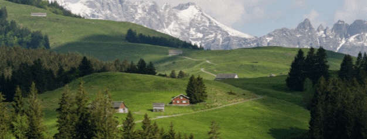
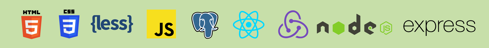
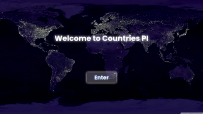
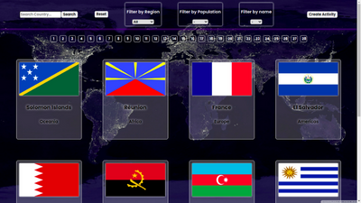
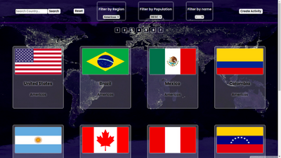
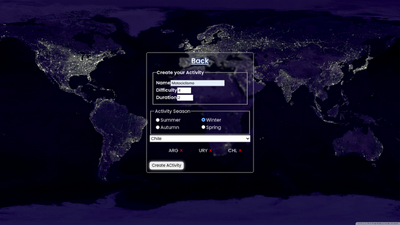
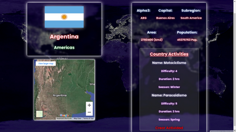

<h2 style="text-align: center">Full Stack Developer 💻 from Argentina 🇦🇷 to 🌎</h2>
 

<h1>🌟 Languages and Tools 🌟</h1>

    

<h1>📌 My main project 📌</h1>

 

<h1>📨 How to reach me: 📨 </h1>

 

<h2 style="text-align: center; margin-top:20px"> Have a nice day! </h2>
<!--
**BPugna/BPugna** is a ✨ _special_ ✨ repository because its `README.md` (this file) appears on your GitHub profile.

<!-- Here are some ideas to get you started:

- 🔭 I’m currently working on ...
- 🌱 I’m currently learning ...!
- 👯 I’m looking to collaborate on ...
- 🤔 I’m looking for help with ...
- 💬 Ask me about ...
- 📫 How to reach me: ...
- 😄 Pronouns: ...
- ⚡ Fun fact: ...
--> 
